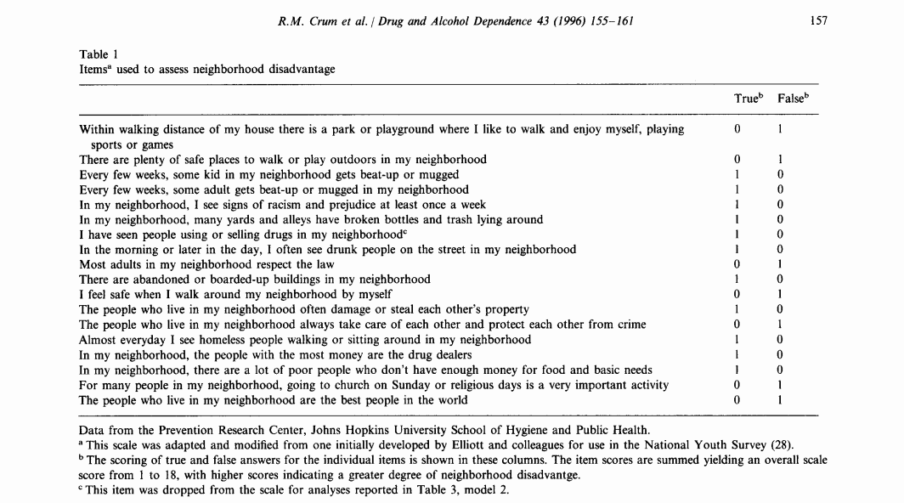
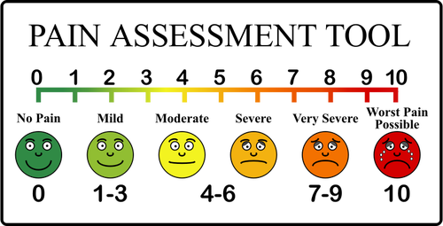
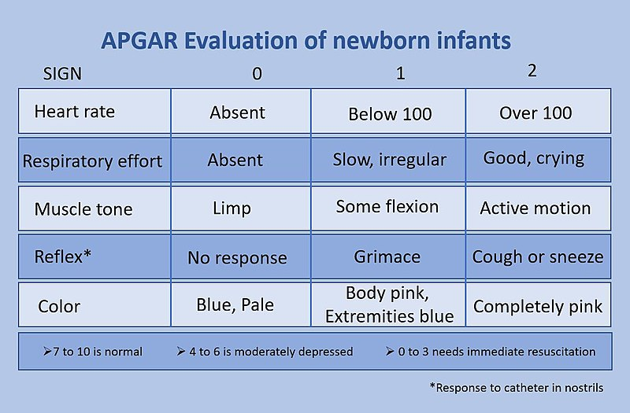
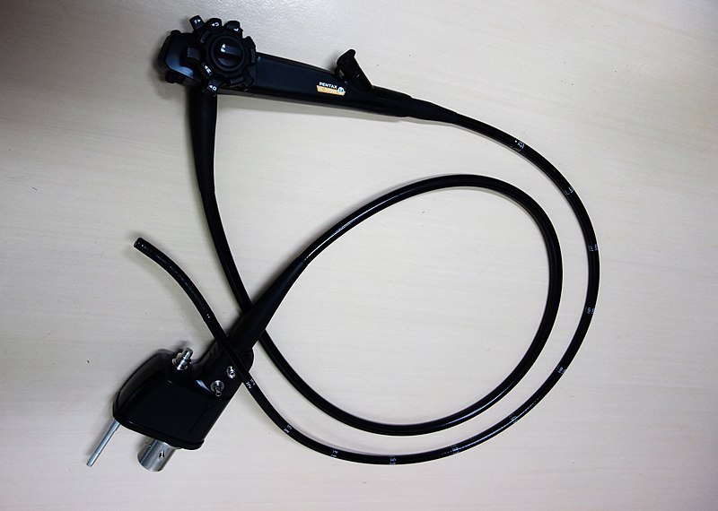
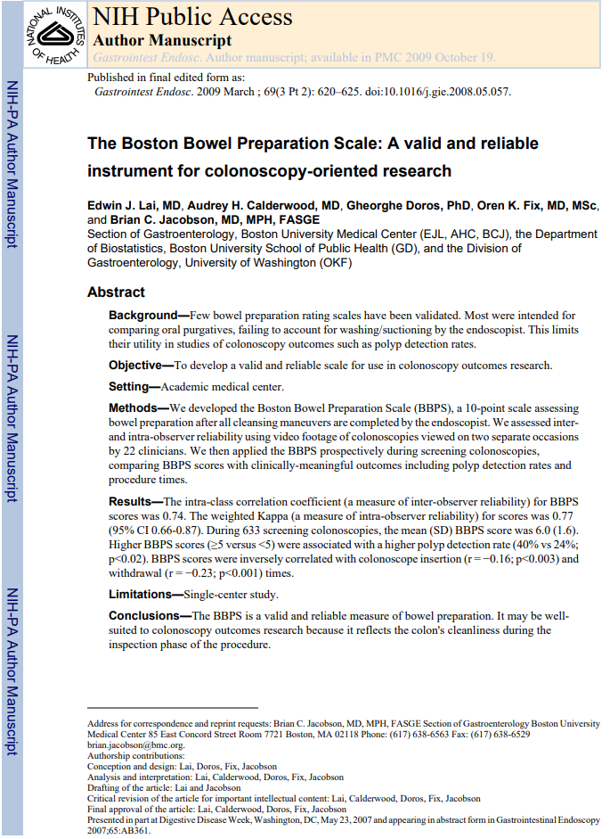
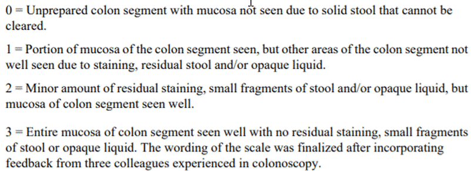
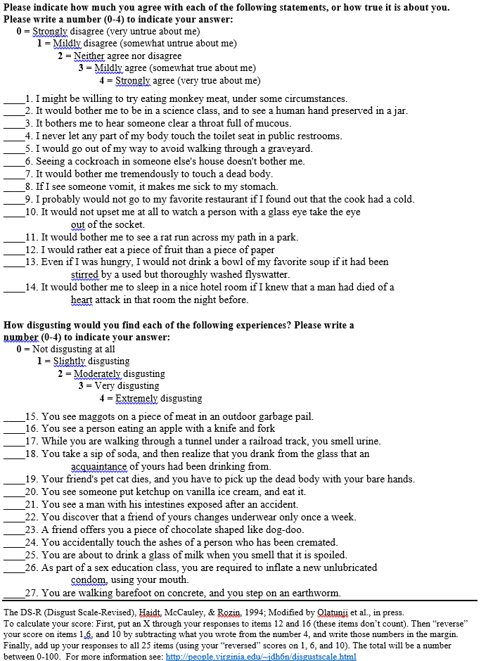

### Outline
+ Five case studies
+ Three dichotomies of measurement
  + Self reported Outcomes versus researcher evaluations
  + Single measurements versus composite scores
+ Assessing reliability
+ Assessing validity
+ Revisit five case studies

Note: add a template with the following line
    reference_doc: T#015 STSP-PPT-Wide-Template.potx

Here is the abstract of this talk, which I am placing in the speaker notes just to serve as a reminder to me of what I should be sure to cover.

"Practical advice for establishing reliability and validity

You may feel confused about the process of establishing reliability and validity of the measurements that you use in your research study. It is probably caused by the dizzying number of choices available to you. Here’s some practical advice. Reliability and validity are very important, but you can skip the effort entirely for some measurements. Furthermore, some approaches to reliability and validity only make sense for a composite measurement and can be safely skipped for an individual or univariate measurement. For the rest of your measurements, a key distinction is between researcher observation and self-reported information. Some measures of reliability work only for researcher observation and others work only for self-reported information. This talk will outline the steps that you follow in establishing reliability and validity with special emphasis on when you can safely skip some of these steps.

Note: I need to add back into the YAML header the following line
"

### Case study #1 - NES

:::::: {.columns}
::: {.column width="50%"}

:::

::: {.column width="50%"}

:::
::::::

The image on the left is a picture of the Boynton neighborhood in Detroit, Michigan. It was downloaded from 

https://en.wikipedia.org/wiki/File:Boynton_neighborhood_Detroit_(Annabelle_Street).jpg

and is published under a public domain license.

The image on the right is a screenshot from the publication

Crum RM, Lillie-Blanton M, Anthony JC. Neighborhood environment and opportunity to use cocaine and other drugs in late childhood and early adolescence. Drug and Alcohol Dependence 43 (1996) 155-161.

It is copyrighted and made available here through the "Fair Use" provisions of copyright law. Your use of this image may or may not fall under the Fair Use provisions.

This is the Neighborhood Environment Survey.

I realize this image might be difficult to read on your computer. I'm going to magnify this in a bit, but notice that this is a series of 18 true/false questions.

### Case study #1 - NES

Here are some of the questions on the NES. "There are plenty of safe places to walk or play outdoors in my neighborhood" and "Every few weeks, some kid in my neighborhood gets beat-up or mugged." These question are answered true/false and points of 0 or 1 are assigned. Notice that some of the questions get a 1 for true and some of the questions get a 1 for false. The total score is 0 to 18.

This is a self report and it is also a composite measure.

### Case study #2 - Pain scale

:::::: {.columns}
::: {.column width="50%"}

:::

::: {.column width="50%"}

:::
::::::

The image on the left shows a dental procedure underway, hopefully with the patient getting appropriate analgesic medication. It was downloaded from

https://commons.wikimedia.org/wiki/File:Flickr_-_Official_U.S._Navy_Imagery_-_Dental_procedure_aboard_USS_Abraham_Lincoln.jpg

and is in the public domain.

The image on the right is a pain scale. It was downloaded from

https://publicdomainvectors.org/en/free-clipart/Pain-scale/50153.html

and is in the public domain.

This is a pain scale. Pain is something that cannot be easily observed by an outsider. You are best off asking someone directly what their pain is like.

This is self report, but it is a single measure rather than a composite. You will handle this differently.

### Case study #3 - Apgar score

:::::: {.columns}
::: {.column width="50%"}

:::

::: {.column width="50%"}

:::
::::::

The image on the left of a newborn infant was found at 

https://commons.wikimedia.org/wiki/File:HumanNewborn.JPG

and is published on an open source license.

The image on the right shows the five components of the Apgar score. It was found at 

https://commons.wikimedia.org/wiki/File:APGAR_score.jpg

and is published on an open source license.

This is the Apgar score. It is a measurement taken one minute after a person is born. No self report is possible for a person who is one minute old, so it has to be measured by an outsider. There are five components to the Apgar score, each rated as zero, one, or two. Just a hint here. If you happen to be born, being blue, limp, and not crying is a very bad thing.

### Case study #4 - Boston Bowel Prep Score

:::::: {.columns}
::: {.column width="50%"}

:::

::: {.column width="50%"}

:::
::::::

The image on the left is a colonoscope. It was downloeaded from 

https://commons.wikimedia.org/wiki/File:PENTAX_Colonoscope001.jpg

and is published under an open source license.

On the right is the first page of a publication available through Pubmed Central. It is also available under an open source license.

This an except from an article establishing the reliability and validity of the Boston Bowel Prep score. When you get a colonoscopy done, you're supposed fast for a full day and also drink a foul tasting preparation. Almost a gallon of this stuff. When you're done, the next day, your bowel is cleaned out enough that the colonoscopist can go hunting for polyps in your colon.

An objective measure of how well you did with your fasting and with your drink preparation is the Boston Bowel Prep Score. This is an excerpt from the research article that established reliability and validity of this measure.

Lai EJ, Calderwood AH, Doros G, Fix OK, Jacobson BC. The Boston bowel preparation scale: a valid and reliable instrument for colonoscopy-oriented research. Gastrointest Endosc. 2009 Mar;69(3 Pt 2):620-5. doi: 10.1016/j.gie.2008.05.057. Epub 2009 Jan 10. PubMed PMID: 19136102; PubMed Central PMCID: PMC2763922.

### Case study #4 - Boston Bowel Prep Score

Here's a careful look at the four values. O means that you can't see anything because of the presence of solid stool (somebody didn't fast like they should have!) and 3 means only small fragments of stool or opaque liquid. You don't want a zero because they'll make you do the colonoscopy all over again. By the way, there were some pictures in this article and I did not include them in this talk. Thank me for this later.

This is an example of a physician report. No self report is available here. But you still want to examine reliability and validity because this does have the potential to be perceived as subjective.

Note also that, unlike the Apgar score, this is not a composite measure. There is a single number that you get.

### Case study #5 - Disgust Scale Revised

:::::: {.columns}
::: {.column width="50%"}

:::

::: {.column width="50%"}

:::
::::::

The facial expression of disgust was downloaded from

https://commons.wikimedia.org/wiki/File:Disgust_expression_cropped.jpg

and was originally posted at
	
https://www.flickr.com/photos/iamagenious/2490996809

This image is published under an open source license.

The screenshot from "The Disgust Scale Home Page" at 

http://people.stern.nyu.edu/jhaidt/disgustscale.html

is copyrighted and is covered under the "Fair use" provisions of copyright law. Your use of this image may or may not be covered.

### Review

+ What you've seen so far
  + Five case studies
+ What is coming next
  + Three dichotomies of measurement
  + Assessing reliability
  + Assessing validity
  + Revisit five case studies
  

so far, you've seen five case studies where you may want to assess reliability and validity. These are very different types of measurements and you can classify them into three important dichotomies. These three dichotomies will help you assess the best approach to take for assessing reliability and validity.

### Measurement quotes (1 of 2)
  
+ "The government is extremely fond of amassing great quantities of statistics. These are raised to the Nth degree, the cube roots are extracted, and the results are arranged into elaborate and impressive displays. What must be kept ever in mind, however, is that in every case, the figures are first put down by a village watchman, and he puts down anything he damn well pleases." 
  + Sir Josiah Stamp, as quoted on [Quotetab](https://www.quotetab.com/quotes/by-josiah-stamp).

As much as I love numbers, I have to admit that they are often abused. Just because you can attach a number to something does not mean that the number is useful in any way. I want to talk about some of the problems associated with measurement and some of the great pains that you need to take to be sure that your numbers have meaning.

### Measurement quotes (2 of 2)

+ "only scientists are arrogant enough to think that they always observe with rigorous and objective scrutiny"
  + Stephen Jay Gould, The Mismeasure of Man, page 36.

I also have to quote Stephen Jay Gould here as well. He wrote an excellent book, The Mismeasure of Man, that addresses many of the points I will talk about today from the perspective of intelligence tests. It is well worth reading because it helps you to resist the temptation to think that writing down a number and giving it a name is enough. You have to think long and hard about whether your measurements are of sufficient quality that you can rely on them to draw firm conclusions about the clinical care that you provide to your patients.

### First dichotomy: Who is the measurer?

+ Self reported outcomes
  + Also know as patient reported outcomes
+ Researcher evaluations
  + Only when concerned about subjectivity

For better or for worse, researchers tend to focus greater attention on certain types of measurements. There's no hard and fast rule here, but issues of measurement quality tend to appear most often in certain areas.

Don't think that if your measure is not on this list that it doesn't deserve careful scrutiny. There's really no consensus in the research community on what measurements require this extra level of attention.

I think it is a bit unfair, but there is a lot of distrust of  reported outcomes among researchers. Why not believe what the patient says about himself or herself? Part of it might be that a patient's answers could potentially be influenced by their mood. They might also be influenced by a desire to look good. They may want to give an answer that they think the interviewer wants to hear.

There is also a belief that  reported outcome measures vary too much from one individual to another. Some people are stoic to a fault and others will complain endlessly at the drop of a hat.

It is worth noting that these factors also influence researcher observation, but researchers don't like it when you point this out to them. It's mostly a good thing that researchers require a high level of scrutiny of  reported outcomes, but perhaps other measures deserve just as high a level of scrutiny.

There is a fair amount of scrutiny of researcher evaluations when these evaluations are perceived as having a high level of subjectivity. Now, our perceptions as to what is subjective are also subjective, so you need to be careful.

### Second dichotomy: How many pieces?

+ Composite scores
  + Sum or average
+ Single measurement

Many measures in research are composites of one or more items. These individual items are scored and added up to get a total. Sometimes you average them instead of summing them. That's a minor distinction. In general, a composite measure involves evaluating something from many different angles. If you do this well,, this can be a very effective approach. But you do need to be careful.

In contrast, some measures are just a single number and there is no summing or averaging involved. There is just a single question or a single evaluation. It is a difficult decision to choose whether to develop a measurement using a composite scale versus a single measurement, and it depends a lot on what you are measuring.

The general consensus among researchers is that you get a better picture of something with a composite scale, but some measures do not warrant this extra effort.

### Third dichotomy: is the measure soft or hard?
+ Constructs
  + Created and accepted by you and me
  + Impossible to observe directly
  + Examples: stress, anxiety
  

Constructs are measurements of something that is considered soft. They do not have an indepent existence but are created by society. Almost all measures in psychology, such stress and anxiety, are constructs because you do not have the ability to peer inside someone's brain.

  
### Third dichotomy: is the measure hard or soft
+ Biological or physical measure
  + Has an objective reality
  + Potential for direct observation
  + Example: obesity, dementia
  

Some people argue that everything is socially constructed, but this is rather silly, in my opinion. Some things have an objective reality and were not created by us. Obesity is a physical concept that can be measured using body mass index, percentage of body fat, waist to hip ratio and many others. They all represent a physical manifestation of excess weight. Dementia also has a physical manifestion. You can't measure it without autopsy perhaps, but there is a physical change in your brain that causes dementia.

### Examples of self reported outcomes

:::::: {.columns}
::: {.column width="50%"}

:::

::: {.column width="50%"}

:::
::::::

The Neighborhood Environment Scale is a self report. You could get a researcher to drive through a neighborhood and assess its environment, but asking the residents themselves is faster, and possibly more accurate.

The pain scale is also a self report. If you are assessing pain in adults and children, you normally rely on self-reports. A researcher can assess pain in infants who are nonverbal by looking for facial expression, leg and arm movements, and other signs. In animals, it depends on the animal, but there are often clues in their appearance and behavior. Still, it is preferred to use self report for pain and you can get reliable measures from very young children.

### Examples of researcher evaluation

:::::: {.columns}
::: {.column}

:::

::: {.column}

:::
::::::

You cannot ask for a self report in a newborn infant. Actually, this newborn is offering a fairly strong assessment of his/her condition, but normally an outsider will assess how an infant is doing immediately after birth.

You also do not see self reports in assessing the bowel preparation, unless you are self-administering a colonoscopy. Definitely not recommended!

### Examples of composite scores

:::::: {.columns}
::: {.column}

:::

::: {.column}

:::
::::::

The neighborhood environment scale is a composite measurement because you ask 18 separate questions. The Apgar score is also a composite measurement because you rate the infant on five separate items.

### Examples of single measurements

:::::: {.columns}
::: {.column}

:::

::: {.column}

:::
::::::

The pain score is a single measurement. You do not ask about five different types of pain and add them up. Likewise, the Boston Bowel Prep score is a single measurement.

### Examples of constructs

:::::: {.columns}
::: {.column width="50%"}

:::

::: {.column width="50%"}

:::
::::::

### Examples of biological or physical measurements

:::::: {.columns}
::: {.column width="50%"}

:::

::: {.column width="50%"}

:::
::::::

### Pop quiz

:::::: {.columns}
::: {.column}

:::

::: {.column}
+ Is the disgust score 
  + a self report or
  + a researcher evaluation?
+ Is the disgust score
  + a composite measure or
  + a single measurement?
  
:::
::::::

I put in the disgust scale because it is the perfect example of a psychological construct. 

But is it a self report or a researcher evaluation?

Is is a composite measure or a single measurement?

### Review and stop for questions

+ What you've seen so far
  + Five case studies
  + Three dichotomies of measurement
+ What is coming next
  + Assessing reliability
  + Assessing validity
  + Revisit five case studies
+ Any questions?
  

so far, you've seen five case studies and discussed where they fit among the three dichotomies. Next, you'll see various approaches to reliability and when you can or cannot use them.

### Measurement Reliability 

+ Synoynms: consistency, precision, stability
+ Classical test theory
  + Observed value = True value + Measurement error
  + This is a purely hypothetical model
+ Reliability coefficient
  + Variance of true values / Variance of measured values

When you measure something, you want that measurement to be consistent, precise, and stable. You don't want something that changes as the phases of the moon change. You don't want a measurement that changes depending on who the attending physician is. You don't want a measurement that changes depending on any environmental factors that are extraneous to what you are measuring.

If your measure is not stable, then you have difficulty in assessing whether a change in that measurement is due to your intervention or due to the phases of the moon.

Most measures of reliability rely on the true value model. This model says that the observed value of a measurement is equal to the true value plus measurement error. A measurement is reliable if the measurement error is small. Since the true value is almost always unknown, it is only a hypothetical model. 

Your book talks about a reliability coefficient which is the variance of the true scores in a population divided by the variance of the observed scores in a population. Measurement error guarantees that the numerator is always less than or equal to the denominator. The reliability coefficient is equal to one only if there is no measurement error.

You should not be too surprised to find out that the reliability coefficient is a hypothetical value and can never be measured directly. But there are several indirect approaches.

One thing you need to keep in mind is that the reliability coefficient is dependent on the population it is based on. This is very important. Change the population and you change the reliability coefficient. Something with a great reliability coefficient in a population of college students might be terrible in a population with limited literacy skills, for example.

### Measurement Reliability 

+ No measurement is perfectly reliable
  + Strive for 0.7 or higher in research
  + 0.6 is "borderline".
  + Might require 0.9 or higher for individual decisions

Since no measurement is ever conducted without some measurement error, no measurement has perfect reliability. You need to make a value judgement about whether the deviation from the truth is small enough that you can safely ignore it.

There are some informal standards for reliability. These choices can seem a bit arbitrary, but they are fairly well accepted in the research community.

In order for a measurement to be reliable enough to use in a research setting, where you are trying to characterize how a group of people are affected by an intervention, you would like a reliability coefficient of 0.7 or higher. It's not perfect, but the individual measurement errors would be averaged out when you compute group means.

But if you are making decisions that might affect an individual, then you'd want a much higher level of reliability. Individual decisions might involve acceptance into a training program, for example. You would hate to see a large measurement error dominate the decision about an individual. In these settings, a reliability coefficient of 0.9 or higher might be asked for.

For the record, some sources say that your reliability could go as low as 0.6 and still be okay. Other sources disagree. If you have such a value, go ahead and report it using a term like "borderline" or "marginal" and hope that your peer-reviewer isn't a stickler for this sort of thing.

Reliability is usually established when a measure is developed. When you go about using a measure, look at what's already been published. Make sure it used in a context similar to yours. It's a whole lot easier to find a measurement that is already proven to be reliable than to develop your own measure and then establish its reliability.

### Indirect measures of the reliability coefficient

+ Test-retest
+ Interrater
+ Internal consistency

Even though the reliability coefficient cannot be measured directly, you can usually get at it indirectly. What you do it take two measurements where the true value is expected to stay reasonably constant. If the two observed values correlate well, then you have indirect evidence that the measurement error is small.

### Test-retest reliability (also called repeatability)
+ Correlation of two measurements separated by time
+ Length of time interval is critical
  + No carry-over
  + No changes in the true score
+ Useful for composite scores and single values
+ Useful for self-report and researcher evaluation
+ Not possible for some measures

Test-retest reliability is the correlation coefficient of two measurements taken at different times. This is also known as repeatability.

The correlation coefficient between the two measurments is an estimate of the reliability coefficient.

The time interval is critical here. You don't want two measurements that are so close together that the measurement error for the first measurement is correlated with the measurement error of the second measurement.

Suppose you are measuring your patient's knowledge about a disease. If you give the same test only a few minutes apart, your patient will remember his/her answers to the first test when answering the second test.

So you want a long enough time interval that there is no carry over effect.

But too large an interval is also problematic. You want to make sure that the true score is the same (or very close)

Over what size interval would you expect the measure to be stable? It depends on what you are measuring. Intelligence is likely to be stable along long time frames but mood changes rapidly.

Test-retest reliability works well for any type of measure. But it can't always be applied. The Apgar score has to be measured at the time of birth. If the baby is blue, limp, and unresponsive after three hours, that's not quite the same as the same occuring right after birth.

### Inter-rater reliability

+ Simplest case
  + Two independent raters
  + Ratings for every patient
+ Analysis
  + Intraclass correlation or Cohen's Kappa
+ Extensions
  + See Audrey's webinar
+ Used for researcher evaluations only

When the researcher does the evaluation and there is concern that a subjective element may creep in and cause measurement error. Your observed score might be higher or lower depending only on who is rating you.

Reliability is pretty simple to measure in this setting, if you have the resources. Just get two raters and have them both compute the measurement. If the correlation between the two raters is high, you have good reliability.

Rather than computing a direct correlation, inter-rater reliability is usually computed as an intra-class correlation. The intraclass correlation generalizes naturally to more complex settings.

If your measurement is binary (note the entire measurement is binary, which is not the same as saying that the individual components of a composite score are binary), then a different statistic, Cohen's Kappa is used. Like the intraclass correlation, there are extensions of Kappa to multiple raters.

You can't always have all the raters rate all the patients, especially if you have more than two raters. There are extensions to cases where you have random assignments of patients to different raters, but the formulas are tricky.

### Measures of internal consistency

+ Cronbach's alpha
+ Variations on Cronbach's alpha
  + Split half correlation with Brown-Spearman adjustement
  + Kuder-Richardson 20
+ Only used for composite measurements

If your measurement is a composite measure, then you can look at the internal consistency of the individual components to assess reliability.

This is most commonly done with a statistic known as Cronbach's alpha. I will not define it here, but you can find the formula on the web.

There are some close cousins to Cronbach's alpha, such as the split half correlation and Kuder-Richardson 20 but don't worry about these variations.

You can only use Cronbach's alpha or any of its variants for composite measurements.

### Criticisms of Cronbach's alpha
+ Not a substitute for other methods for assessing reliability
+ Affected by number of components
+ Not a measure of unidimensionality
+ Not useful for scale purification
+ My recommendation
  + Only use it if you are forced to

I have never liked Cronbach's alpha. It is easy to compute. Too easy. I think people rely on it because they did not want to take the time or trouble to use a better measure of reliability like test-retest reliability or inter-rater reliability.

Alpha is affected by the number of components in a composite scale. But it is a rather arbitrary relationship. Adding more items to a composite scale will always increase alpha. So if you got a substandard result with Cronbach's alpha, you could "game" the system by adding more components, even if those components did not add any value.

Alpha is also not a measure of unidimensionality. Unidimensinoality means that you are measuring one thing and one thing only. This is important for validity, because if you are mixing two things together, you will not have validity for either measure. But internally consistent measures could easily be bi-dimensinoal or tri-dimensional.

Some people use a "leave one out" approach to reliability and if Cronbach's alpha improves markedly when one item is removed, that is, to them, an indication that the scale could be improved (purified if you will) by removing that item.

  
### Cronbach’s alpha - my recommendation
+ Always try to get test-retest or inter-rater reliability
+ Use confirmatory factor analysis for
  + Unidimensionality
  + Scale purification
+ Put it in only if you are forced to

It is more work but always try to get either test-retest or inter-rater reliability.

If you are worried about unidimensionality or want to purify your scale, use confirmatory factor analysis.

Alpha is not a terrible statistic, just not very helpful. So if your boss or a peer-reviewer demands it, why bother fighting. As long as you do other assessments of reliability, you should be okay.

  
### Practical guidance on reliability

+ Is there previous literature?
  + Report their reliability coefficients
+ Reassess reliability if you have
  + Different demographics
  + Different cultural norms
  + Different literacy
  + Different language

You should include a discussion of reliability in your literature review. Cite the reliability coefficients in previous work, as it adds to the credibility of your proposed research.

But take a step back and ask if you can extrapolate safely to the research setting that you propose. Recall the hypothetical reliability coefficient. It compared the variation of the true score to the variation of the observed score across patients in the population you are studying. If your population is quite different than the populations in your literature review, you have no guarantee that a measurement proven to be reliable in previous work will continue to stay reliable in your setting.

Some differences to look for are differences in the demographics of your population, differences in cultural norms and expectations, differences in literacy levels (especially for measurements that require your patients to read and respond to a questionnaire).

If you are measuring something that requires translation to a different language, keep in mind that not all concepts translate well from one language to another. Sometimes it helps to pay for a second and independent translation back to the original language. If there are discrepancies, then maybe it was in the back-translation, but more likely, you are asking for a different type of information in your new language without realizing it.

If you can, incorporate a measure of reliability into your study. There are two reasons for this. First, your setting may be different enough to raise concerns. Getting a current measure of reliability helps to allay those concerns. Second, reliability is never quite perfect, because all of the measures of reliability are indirect measures. Your effort to assess reliability will supplement the previous work on reliability and make things a bit easier for future researchers.

I have a strong preference for test-restest reliability or inter-rater reliability, if you can get it.  The other measures of reliability, parallel forms, the split half correlation, Kuder-Richardson 20, and Cronbach's alpha are measures of the internal homogeneity of your composite measure. In my mind they are a poor substitute for test-retest reliability or inter-rater reliability.

I do not like these measures. Let me restate that. I despise these measures. They are simplistic and fail to measure what I think are the important features of reliability (stability over time and consistency between raters). I think people use them mindlessly and fail to recognize that they are measuring something very limited.

If you can't measure reliability using a test-retest approach or using inter-rater reliability, then go ahead and use these other approaches. But they are a pale substitute in my opinion.

The general target value for a reliability coefficient is 0.7 or higher. You might get by with a reliability coefficient of 0.6, but don't count on it.

### Review and stop for questions

+ What you've seen so far
  + Five case studies
  + Three dichotomies of measurement
  + Assessing reliability
+ What is coming next
  + Assessing validity
  + Revisit five case studies
+ Any questions?
  

Wow. That's a lot to digest. Don't be afraid to ask me questions about reliability. Let's take a break here for questions. We talked about measures of internal consistency and why I don't like them. We also talked about some practical advice: report reliability measures from your literature review and measure reliability, if you can, in your current study.

Next, we'll tackle measurement validity.

### Measurement Validity 

+ Reliability by itself is not enough.
  + Consistent measures of the "wrong thing" is bad
+ Examples of the wrong thing
  + Measuring anxiety instead of stress
  + Measuring transient changes in a patient's mood rather than chronic depression
+ Reliability is a pre-requisite for validity
+ Validity is a journey and not a destination

Reliability by itself is not enough. That seems a bit unfair. You had to do a lot of work to establish reliability. But you can't stop there. If you have a reliable measurement, one that is consistent across time and between raters, then you could still have problems because you might be measuring the wrong thing.

This can happen very easily. You might think that you are measuring the stress that a patient is enduring, but it might be a measure of anxiety instead. Now these are often related, but people can experience one without the other very easily. Another example would be measuring transient changes in mood versus chronic depression.

So in addition to establishing that your measurement has good reliability, you also have to establish good validity.

Validity is the degree to which a measure measures that which it was intended to measure.

If you intend to measure A and you measure B instead, you have poor validity.

Now I talked about reliability first because it is a pre-requisite for validity. If a measurement is inconsistent across time or between raters, it can't be measuring what you want it to measure. It needs stability and consistency first.

The other thing to keep in mind is that validity is not something that you establish and then you're done. Validity is a journey and a never-ending journey at that. Each study in a series of studies that uses a particular measurement will contribute information about the validity about a measurement.

### Types of measurement validity 

+ Validity is the degree to which a measure measures that which it was intended to measure
+ Types of validity
  + Face/content validity
  + Response process validity
  + Criterion validity
  + Construct validity

There are several different ways to establish validity. I'll talk about each of these in turn.

### Face validity and content validity

:::::: {.columns}
::: {.column width="50%"}
+ Face validity
  + Opinions from your patients
  + Subjective and unquantifiable
+ Only used for composite measures
:::

::: {.column width="50%"}
+ Content validity
  + Opinions from outside experts
  + Subjective and unquantifiable
+ Only used for composite measures
:::
::::::

There are varying definitions of face validity and content validity. Let me share the defintions that I like. This is my class and I get to dictate the rules. But I'll let you know what others define these two terms as.

Face validity is information from your patients, typically for a composite measurement. They look at the individual items in your composite measurement and tell you the ones that don't really belong. They should also tell you about items that are missing in your composite measurement that you should include. Face validity is a totally subjective approach and to some people it seems like letting the inmates run the asylum.

To be fair, face validity is an important step in establishing validity, but it should probably not be the only step.

Content validity is information from content experts rather than your patients. But otherwise, it is the exact same thing. The experts look at your composite measurement and tell you that certain things need to go and other things need to be added.

Now, who is an expert? It can be anyone, really. Normally, you would use credentials like a degree and a publication record in the area to establish that someone is qualified to tinker with your measurement.

Both face validity and content validity are purely qualitative. There is no numeric measure or score that you get from these types of validity. You do have to establish consensus, if you seek face validity or content validity from more than one source, but this is usually established qualitatively.

There are structured ways to get information about face and content validity from your patients and from an expert panel, such as the Delphi method. You can use these methods, or you could just use a structured interview.

Even though these approaches are soft, they are well worth the effort.

Now some people use the terms face validity and content validity interchangably. Your book says that face validity is just looking at the measure and giving a general impression while content validity requires delving into the individual items of a composite measure.

I won't say that your book is wrong, but your book is wrong. Actually, I'm probably wrong, but I'm your teacher and you're stuck with my opinion, at least until the semester ends.

Seriously, if there is a disagreement in the research community about how to establish validity, what you do is you do it your way, but with the expectation that when you submit your paper to peer review, plan for the possibility that the peer reviewer will ask you to define things their way. It's normally not a good idea to fight a peer-reviewer, especially when there is no consensus in the research community, unless they are asking for something that is seriously wrong and misleading.

Now your teacher, on the other hand, you can argue with him until the cows come home. He actually will enjoy the argument and you won't get him to shut up about the varying research perspectives.

### Response process evidence

+ Observe the process
  + Watch as patients fill out the form, monitor response times
  + Ask questions along the way, encourage them to think aloud
+ Supplement with interview
+ Goal is to identify Confusion, misunderstandings, language issues
+ Used only for composite measures

Response process validity is the direct observation of patients as they fill out the survey that you are using for measurement. You can think of it as part of the face validation, or you can call it an additional type of validation. I like the latter because it sounds more impressive.

There's nothing too difficult about this. As you observe the process, ask questions, see if there are any items that seem to take too long to answer. Encourage your patients to talk aloud as they are working. If you want to get really fancy, you can use eye tracking to see if someone is losing focus or getting distracted.

You can supplement this process with an interview afterwards. Your goal in this exercise is to identify items that are confusing or ambiguous, or which seem to draw the wrong type of response. Look especially for issues which may come from the use of excessively technical language.

You can do this sort of exercise with experts as well as patients. Ask your experts to pretend that they are patients and get them to fill things out, talk aloud, and ask them questions along the way.

### Criterion validity

+ Comparison to external criterion
  + Represents "truth"
  + Not always available
+ Predictive evidence
  + Measurement in the future
  + Example: Imaging study confirmed by later biopsy
+ Concurrent evidence
  + Measured at the same time
  + Example: Smoking self report compared to saliva nicotine levels

Criterion validity is the most straightforward approach to establishing validity. You want to see how well your measurement corresponds with what it's supposed to measure. So include what your supposed to measure and see how strongly it correlates with what you want to measure.

This isn't always possible, of course, but if you can measure truth then go for it!

Now, why, might you ask yourself, would you use a measurement that correlates well with truth when you can measure truth directly? It probably has something to do with time or money. You can measure the truth but it costs too much to do it in a big study. Or it takes way too long. So you run a smaller study where you measure truth, show that your cheaper and faster measurement correlates well with the truth, and then you can save a whole bunch of time and money in the big study.

Your evidence for validity is predictive evidence if the truth represents something that occurs in the future, meaning after your measurement is taken. In the big study, you can't wait around and wait for the truth to reveal itself. But in a smaller study, you might have that luxury.

It's important in using predictive evidence that you don't have dropouts, especially if those dropouts tend to differ from those who do provide you with data.

Your book offers an interesting example of this with standardized testing for college admission. A school might want to correlate an SAT score, for example, with the grades that a student gets after one year of college. Easy to do, but think about the dropouts. A college, for the most part, is going to admit only those people who score above a cutoff for the SAT. You lose information about those who scored low on the SAT and are left only with those students in a narrow range of SAT scores. It's even worse if the students who score super high on the SAT decide to attend a more prestigious university than your little podunk college.

Another example is using criterion validity for a test intended to diagnose disease. Suppose you have a test that can predict appendicitis. Patients who score high on the measurement, you send them straight to the OR, so you can cut out the appendix before it ruptures. But what about the patients who score low. They probably don't have appendicitis, but you don't know. They won't volunteer to get cut open in the name of science.

Predictive evidence can sometimes take too long, so you may want to use concurrent evidence, evidence that you can collect at the same time as your measurement. Your book suggests that you ask colllege students at the end of their first year to re-take the SAT and see how that re-take correlates with the grades they are just receiving. It's not perfect, but it certainly takes less time.

The other application of concurrent evidence is when you don't have a direct measure of truth, but you have an already validated measure of truth that you can collect concurrently with your new measure. The assumption here, as earlier is that your new measure is cheaper or faster than the currently used and validated measure. If you correlate well with an already validated measure, and that validated measure has already been shown to correlate well with the truth, then you have indirectly established criterion validity.

Now this approach has limits. You can never get quite as much evidence of validity as the already validated measurement has.

### Construct validity

+ No direct measure of the truth exists
+ Define associations consistent with your constuct
  + Does your measurement show the expected association?
  + Known as convergent evidence
+ Define non-associations with your construct
  + Does your measurement also show non-association?
  + Known as discriminant or divergent evidence

Construct validity is when you are developing a psychological construct and you don't have a direct measure of the construct you are trying to measure. What you do have is various associations and non-associations that your construct is expected to have. You develop these using your deep thinking power or maybe just a bit of common sense. If your measurement shows the same associations and non-associations that you would expect your construct to have, you have established construct validity.

### Factor analysis as a form of validation
+ Establish unidimensionality
+ Scale purification
+ Exploratory versus confirmatory

Some researchers have argued that factor analysis offers a way to establish validity. The literature is not very clear on how factor analysis fits in to validity. Factor analysis is a useful tool to establish unidimentionality. Unidimensionality means that all of the components of a composite score are measuring the same thing. But without knowing what that "thing" is, how does this help establish validity? Typically, you would combine unidimensionality with face or content validity.

Factor analysis is also used for something known as scale purification. If you have twelve items for a composite scale, factor analysis might identify two that don't really correlate well with the other ten. Then you would improve the composite measure by tossing the two components out.

I dislike this because I think it is a mistake to tinker with a scale that has worked well in the past.

If you use factor analysis, you have the choice between exploratory factor analysis and confirmatory factor analysis. Both are fine, but if you had to choose, you should use exploratory factor analysis when you are a pioneer in this area of measurement and use confirmatory factor analysis when the measurement already has an established track record.

### Review and stop for questions

+ What you've seen so far
  + Five case studies
  + Three dichotomies of measurement
  + Assessing reliability
  + Assessing validity
+ What is coming next
  + Revisit five case studies
+ Any questions?
  

That's pretty much it, except for a revisit to the five case studies.

### Case study #1

Here is the Neighborhood Environment Survey again.

This is a self report and it is also a composite measure.

### Case study #1 - Neighborhood environment survey

### Case study #1 - Neighborhood environment survey
+ Reliability - What you can't do
  + Inter-rater reliability
+ Reliability - What you can do
  + Test-retest reliability
  + Cronbach's alpha

This is a composite measure and a self report. You can't compare two or more raters because there is only one "self."

Cronbach's alpha is used for components that are continuous and this scale has binary (true/false) statements.

It is easy to run a test-retest reliability study. Neighborhoods don't change overnight, so it would be fine to wait a week or so.

You can also run Cronbach's alpha here. If you are a stickler for detail, the reliability measure in this case is better described as Kuder-Richardson 20 because the individual components are binary.

### Case study #1 - Neighborhood environment survey
+ Validity - What you can't do
  + Criterion validity
+ Validity - What you can do
  + Face/content validity
  + Response process validity
  + Factor analysis
  + Construct validity

### Case study #2

This is a pain scale again. It is a self report, but it is a single measure rather than a composite.

### Case study #2 - Pain scale

### Case study #2 - Pain scale
+ Reliability - What you can't do
  + Inter-rater reliability
  + Cronbach's alpha
  + KR-20
+ Reliability - What you can do
  + Test-retest reliability

Like the first measurement, this self report scale cannot compare two or more independent raters. It is a single measurement, so you can't apply Cronbach's alpah or KR-20.

Test-retest reliability works well here, but you have to make sure that you are quick. A narrow time interval between the test and the re-test is important if you are looking at acute pain.

### Case study #2 - Pain scale
+ Validity - What you can't do
  + Face/content validity
  + Response process validity
  + Criterion validity
  + Factor analysis
+ Validity - What you can do
  + Construct validity

### Case study #3

This is the Apgar score again. T is a composite measure collected by the researcher and not by self report.

### Case study #3 - Apgar score

### Case study #3 - Apgar score
+ Reliability - What you can't do
  + Test-retest reliability
  + KR-20
+ Reliability - What you can do
  + Inter-rater reliability
  + Cronbach's alpha

Because timing is important, you cannot evaluate the Apgar score at one minue and at two hours. You also can't use KR-20 because it is not binary.

Inter-rater reliability is very easy and very useful here. Have two raters at the scene of the birth and ask them to estimate the Apgra score. No peeking! Then correlate the responses.

Cronbach's alpha is really intended for continuous components, and values of 0, 1, and 2 are not really on a continuum. But there is nothing terribly wrong with pretending it is continuous. 

### Case study #3 - Apgar score
+ Validity - What you can't do
  + Construct validity
+ Validity - What you can do
  + Face/content validity
  + Response process validity
  + Criterion validity
  + Factor analysis
  

Construct validity is hard to apply here. There is no theory of what an Apgar is or is not associated with.

It is a composite measure so you can have experts review the individual components. You can also watch as someone answers the five components of the Apgar score. There are several predictive criterion. Does a low Apgar score predict infant mortality?

You can run a factor analysis on the Apgar score because it has multiple comonents.

### Case study #4

This is an example of a physician report. No self report is available here. But you still want to examine reliability and validity because this does have the potential to be perceived as subjective.

Note also that, unlike the Apgar score, this is not a composite measure. There is a single number that you get.

### Case study #4 - Boston Bowel Prep Score

### Case study #4 - Boston Bowel Prep Score
+ Reliability - What you can't do
  + Test-retest reliability
  + Cronbach's alpha
  + KR-20
+ Reliability - What you can do
  + Inter-rater reliability

### Case study #4 - Boston Bowel Prep Score
+ Validity - What you can't do
  + Face/content validity
  + Response process validity
  + Factor analysis
  + Criterion validity
+ Validity - What you can do
  + Construct validity
  

### Conclusion
+ What you've seen today
  + Five case studies
  + Three dichotomies of measurement
  + Assessing reliability
  + Assessing validity
  + Revisit five case studies
+ Any questions?
  

Different measures of reliability and validity apply depending on whether your measurement is a self report or not and depending on whether it is a composite measure or not.

